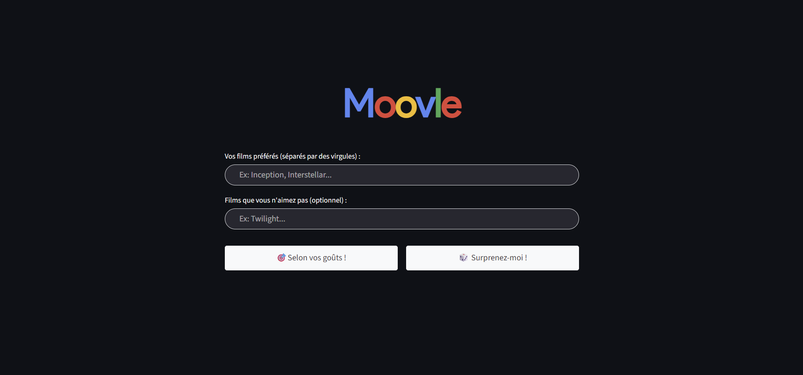

# 🎬 Moovle

  

> 🔗 **[Tester l'app](https://moovle-76549270860.europe-west9.run.app)**

## C'est quoi ce projet ?

**Moovle** est un moteur de recommandation de films ultra-personnalisé. 

Fini les recommandations génériques : indiquez vos films préférés (et ceux que vous aimez moins), et l'IA vous déniche 3 pépites sur mesure en affichant automatiquement **leurs affiches officielles**. 

L'application propose deux approches :
* **Recherche classique :** Des recommandations ciblées selon vos goûts exacts.
* **Mode "🎲 Surprenez-moi !"  :** Un mode qui vous sort volontairement de votre zone de confort (genres différents, autres époques, cinéma étranger) tout en gardant votre ADN émotionnel.

**Les petits plus qui font la différence :**
* L'IA génère un court résumé pour expliquer pourquoi le film est recommandé.
* L'app vous dit directement sur quelle plateforme de streaming le film est disponible en France (Netflix, Prime, Disney+, etc.).
* **Mémoire intelligente :** Si vous avez déjà vu l'un des films suggérés, notez-le (de 0 à 10). L'IA en tiendra compte pour affiner ses recommandations suivantes.

---

## Stack

- **Google Gemini 2.0 Flash** — génération de recommandations
- **TMDB API** — affiches + données cinéma + plateformes de streaming
- **Streamlit** — interface web
- **Docker + GCP Cloud Run** — déploiement

## Structure

├── app.py           # Interface Streamlit  
├── services.py      # Appels aux APIs (Gemini + TMDB)  
├── requirements.txt  
└── .env             # Clés API (non versionné)
